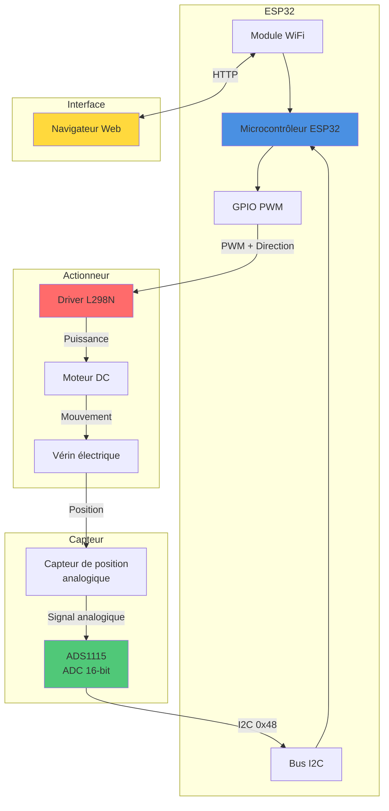
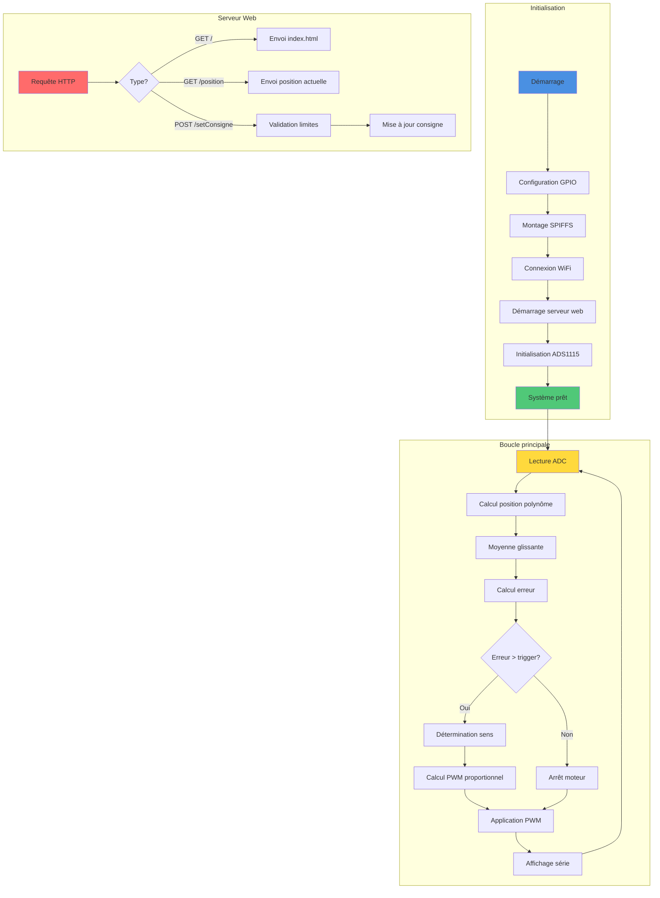

# Projet Verin Commande

Système de contrôle de vérin électrique avec interface web embarquée sur ESP32.

## Table des matières

- [Vue d'ensemble](#vue-densemble)
- [Architecture matérielle](#architecture-matérielle)
- [Architecture logicielle](#architecture-logicielle)
- [Fonctionnement du code](#fonctionnement-du-code)
- [Algorithme de contrôle](#algorithme-de-contrôle)
- [Interface web](#interface-web)
- [Installation](#installation)
- [Configuration](#configuration)
- [Utilisation](#utilisation)
- [Spécifications techniques](#spécifications-techniques)

## Vue d'ensemble

Ce projet implémente un système de contrôle de position pour vérin électrique avec les caractéristiques suivantes:

- Contrôle proportionnel de la position du vérin
- Interface web responsive pour la commande à distance
- Acquisition de position via convertisseur ADC 16 bits (ADS1115)
- Filtrage par moyenne glissante pour stabiliser les mesures
- Serveur web asynchrone embarqué sur ESP32
- Validation des limites de sécurité

## Architecture matérielle



### Composants principaux

| Composant | Référence | Fonction |
|-----------|-----------|----------|
| Microcontrôleur | ESP32 | Traitement et contrôle |
| ADC | ADS1115 | Conversion analogique-numérique 16 bits |
| Driver moteur | L298N | Commande bidirectionnelle du moteur |
| Capteur | Analogique | Mesure de position du vérin |
| Vérin | Électrique | Actionneur linéaire |

### Connexions

#### ADS1115 (I2C)
- SDA: GPIO 21
- SCL: GPIO 22
- Adresse: 0x48
- A0: Entrée capteur de position

#### L298N (Moteur)
- IN1: GPIO 17
- IN2: GPIO 16
- ENA: GPIO 18 (PWM)

## Architecture logicielle



## Fonctionnement du code

### Diagramme de séquence détaillé


### Flux de données du contrôleur

```mermaid
flowchart TD
    Start([Lecture capteur]) --> Read[Lecture ADC A0]
    Read --> Convert[Conversion en tension<br/>V = ADC × 4.096 / 32767]
    Convert --> Poly[Calcul position brute<br/>Polynôme degré 4]
    
    Poly --> Buffer[Ajout au buffer<br/>circulaire 10 valeurs]
    Buffer --> Avg[Calcul moyenne<br/>glissante]
    
    Avg --> Error[Calcul erreur<br/>ε = consigne - position]
    
    Error --> Check1{ε > 0.4 cm?}
    Check1 -->|Oui| Extend[Direction: Extension<br/>IN1=LOW, IN2=HIGH]
    Check1 -->|Non| Check2{ε < -0.4 cm?}
    
    Check2 -->|Oui| Retract[Direction: Rétraction<br/>IN1=HIGH, IN2=LOW]
    Check2 -->|Non| Stop[Arrêt moteur<br/>IN1=LOW, IN2=LOW]
    
    Extend --> CalcPWM[Calcul PWM proportionnel]
    Retract --> CalcPWM
    Stop --> PWM0[PWM = 0]
    
    CalcPWM --> CheckBand{|ε| > 3.4 cm?}
    CheckBand -->|Oui| MaxPWM[PWM = 255]
    CheckBand -->|Non| PropPWM[PWM = 160 + k × |ε|<br/>k = 95/3.0]
    
    MaxPWM --> Apply[Application PWM]
    PropPWM --> Apply
    PWM0 --> Apply
    
    Apply --> Display[Affichage série<br/>200ms]
    Display --> Start
    
    style Start fill:#4a90e2
    style Avg fill:#50c878
    style Error fill:#ffd93d
    style Apply fill:#ff6b6b
```

## Algorithme de contrôle

### Contrôleur proportionnel avec zone morte

Le système utilise un contrôleur proportionnel avec les caractéristiques suivantes:

#### Paramètres de contrôle

| Paramètre | Valeur | Description |
|-----------|--------|-------------|
| Zone morte (trigger) | ±0.4 cm | Seuil d'activation du moteur |
| Bande proportionnelle | 3.0 cm | Plage de variation du PWM |
| PWM minimum | 160 | Couple minimum pour vaincre les frottements |
| PWM maximum | 255 | Vitesse maximale |
| Limites position | 6-36 cm | Plage de travail sécurisée |

#### Loi de commande

```
Si |erreur| ≤ 0.4 cm:
    PWM = 0 (arrêt)

Si 0.4 cm < |erreur| ≤ 3.4 cm:
    PWM = 160 + ((|erreur| - 0.4) / 3.0) × 95

Si |erreur| > 3.4 cm:
    PWM = 255 (vitesse maximale)
```

### Filtrage des mesures


Le filtre à moyenne glissante sur 10 échantillons permet de:
- Réduire le bruit de mesure
- Stabiliser la commande
- Éviter les oscillations

### Conversion ADC vers position

La position est calculée à partir de la valeur ADC via un polynôme de degré 4:

```
Position(cm) = 62.9 
             - 0.0145 × ADC 
             + 1.65×10⁻⁶ × ADC² 
             - 9.32×10⁻¹¹ × ADC³ 
             + 2.05×10⁻¹⁵ × ADC⁴
```

Ce polynôme compense la non-linéarité du capteur de position.

## Interface web

### Architecture client-serveur


### Endpoints API

| Méthode | Endpoint | Paramètres | Réponse | Description |
|---------|----------|------------|---------|-------------|
| GET | `/` | - | HTML | Page principale |
| GET | `/style.css` | - | CSS | Feuille de style |
| GET | `/script.js` | - | JavaScript | Code client |
| GET | `/carnus.png` | - | Image | Logo |
| GET | `/position` | - | `"26.5"` | Position actuelle en cm |
| POST | `/setConsigne` | `c=26.0` | `"OK"` ou erreur | Définir nouvelle consigne |

### Fonctionnalités JavaScript

- Mise à jour automatique de la position toutes les secondes (AJAX)
- Slider interactif avec affichage en temps réel
- Validation côté client et serveur
- Gestion des erreurs de communication

## Installation

### Prérequis

- PlatformIO IDE ou PlatformIO CLI
- ESP32 (NodeMCU, DevKit, etc.)
- Bibliothèques:
  - Adafruit_ADS1X15
  - ESPAsyncWebServer
  - AsyncTCP

### Étapes d'installation

1. Cloner le dépôt:
```bash
git clone https://github.com/axel-g-dev/Projet-Verin-commande.git
cd Projet-Verin-commande
```

2. Ouvrir le projet avec PlatformIO

3. Compiler et téléverser:
```bash
pio run --target upload
```

4. Téléverser le système de fichiers SPIFFS:
```bash
pio run --target uploadfs
```

5. Moniteur série:
```bash
pio device monitor -b 115200
```

## Configuration

### Paramètres WiFi

Modifier dans `src/main.cpp`:

```cpp
const char* ssid = "VOTRE_SSID";
const char* password = "VOTRE_MOT_DE_PASSE";
const char* nomHoteESP32 = "ESP32_VERIN";
```

### Calibration du capteur

Si nécessaire, ajuster le polynôme de conversion (lignes 229-233):

```cpp
float position_brute = 62.9
    - 0.0145 * numCapteur
    + 1.65e-06 * pow(numCapteur, 2)
    - 9.32e-11 * pow(numCapteur, 3)
    + 2.05e-15 * pow(numCapteur, 4);
```

### Limites de sécurité

Ajuster les limites de position (lignes 43-44):

```cpp
const float POSITION_MIN = 6.0;   // cm
const float POSITION_MAX = 36.0;  // cm
```

### Paramètres du contrôleur

Ajuster les paramètres de contrôle (lignes 240-242):

```cpp
float bande_proportionnelle = 3.0;  // cm
float trigger = 0.4;                // cm
int pwm_max = 255;
int pwm_min = 160;
```

## Utilisation

### Démarrage

1. Alimenter l'ESP32 et le système moteur
2. Attendre la connexion WiFi (LED intégrée)
3. Noter l'adresse IP affichée dans le moniteur série

### Accès à l'interface web

1. Ouvrir un navigateur
2. Accéder à `http://[IP_ESP32]` ou `http://ESP32_VERIN.local`
3. La page affiche:
   - Position actuelle du vérin (mise à jour automatique)
   - Slider de commande (6-36 cm)
   - Bouton d'envoi de consigne

### Commande du vérin

1. Déplacer le slider à la position souhaitée
2. Cliquer sur "Envoyer"
3. Le vérin se déplace automatiquement vers la consigne
4. Le système s'arrête dans la zone morte (±0.4 cm)

### Moniteur série

Le moniteur série affiche en temps réel:
```
Position : 26.5 cm | Consigne : 26.0 cm | Erreur : -0.50 cm | PWM : 175
```

## Spécifications techniques

### Performance

| Caractéristique | Valeur |
|-----------------|--------|
| Résolution ADC | 16 bits (ADS1115) |
| Plage de mesure | 0-4.096V |
| Fréquence PWM | 30 kHz |
| Résolution PWM | 8 bits (0-255) |
| Période d'échantillonnage | ~10-20 ms |
| Précision de positionnement | ±0.4 cm |
| Temps de réponse serveur | < 50 ms |

### Consommation

| Élément | Consommation typique |
|---------|---------------------|
| ESP32 (WiFi actif) | ~160 mA |
| ADS1115 | ~150 µA |
| Moteur (PWM max) | Variable selon moteur |

### Sécurité

- Validation des limites logicielles (6-36 cm)
- Zone morte pour éviter les oscillations
- Timeout de connexion WiFi
- Gestion des erreurs I2C
- Validation des requêtes HTTP

### Limitations connues

- Pas de retour d'erreur si le moteur est bloqué
- Pas de détection de fin de course matérielle
- Calibration manuelle du polynôme nécessaire
- Pas de sauvegarde de la consigne en EEPROM

## Structure du projet

```
Projet-Verin-commande/
├── src/
│   └── main.cpp          # Code principal ESP32
├── data/
│   ├── index.html        # Interface web
│   ├── style.css         # Styles CSS
│   ├── script.js         # Code JavaScript client
│   └── carnus.png        # Logo
├── .gitignore
└── README.md
```

## Auteur

Projet développé pour le Lycée Carnus - BTS CIEL

## Licence

Ce projet est fourni à des fins éducatives.
